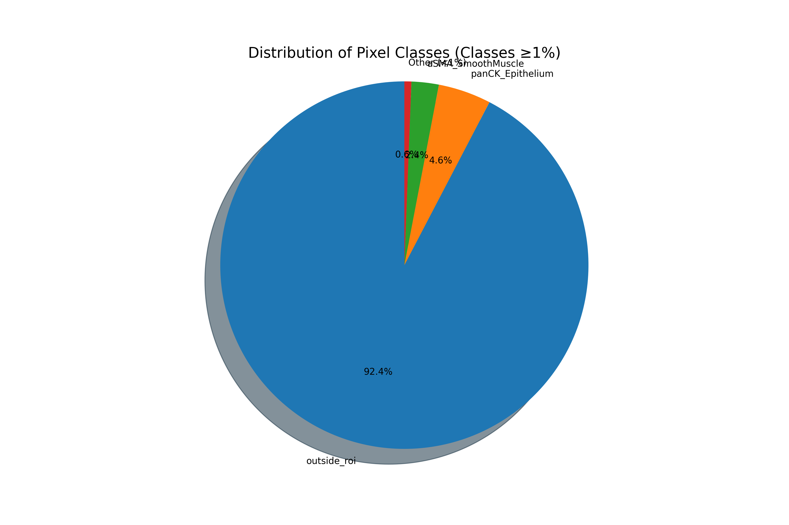

# BSCC Dataset Preparation and Analysis

This repository contains tools for preparing and analyzing the Breast Cancer Segmentation Challenge (BSCC) dataset. The dataset consists of histopathology images with pixel-wise segmentation masks for different tissue types.

## Prerequisites

Before beginning, make sure to install the following dependencies:

```bash
sudo apt install yq  # Required for YAML parsing in shell scripts
```

## Dataset Structure

The dataset is organized into a 5-class segmentation problem. The main directories include:

- `data/5-classes/` - Contains all dataset files
- `meta/` - Contains metadata files like class mappings
- `results/` - Contains analysis outputs
- `scripts/` - Contains data processing scripts
- `notebooks/` - Contains Jupyter notebooks for analysis

## Dataset Preparation Process

Follow these steps to prepare the dataset:

### 1. Split the Dataset

First, split the dataset into training and validation sets:

```bash
bash scripts/1_split_dataset.sh
```

This script:
- Reads configuration from `config/config.yaml`
- Synchronizes data from the source path to the destination path
- Creates train/validation splits based on the specified percentage (90% train, 10% validation)
- Organizes images into appropriate directories

### 2. Count Pixel Classes

Analyze the distribution of pixel classes in the dataset:

```bash
python scripts/2_count_pixel_classes.py
```

This script:
- Reads all mask files from the training directory
- Counts pixels belonging to each class
- Generates a CSV file with class distributions in `results/pixel_class_percentages.csv`

### 3. Reduce Mask Classes

Simplify the original mask classes into a reduced set of 5 classes:

```bash
python scripts/3_reduce_mask_classes.py
```

This script:
- Uses the class mapping defined in `meta/mapper_5.yaml`
- Converts the original multi-class masks to the 5-class format
- Saves the simplified masks to the output directory

### 4. Create Colored Masks

Generate colored visualizations of the masks for easier inspection:

```bash
python scripts/4_color_masks.py
```

This script:
- Takes the simplified masks from the previous step
- Creates colored versions using a predefined color map
- Saves the colored masks for training ControlNet

### 5. Generate Text Prompts

Create text descriptions from the mask images:

```bash
python scripts/5_create_text_prompt.py
```

This script:
- Analyzes each mask image
- Identifies the classes present and their percentages
- Generates descriptive text prompts for each image
- Optionally augments the prompts for diversity

### 6. Prepare Validation Set

Prepare the validation set in a single command:

```bash
bash scripts/6_prepare_val.sh
```

This script:
- Runs steps 3-5 for the validation set
- Creates sample images for validation checks

### 7. Prepare Training Set

Similarly, prepare the training set:

```bash
bash scripts/7_prepare_train.sh
```

This script:
- Runs steps 3-5 for the training set

## Dataset Analysis

After preparation, you can analyze the dataset using the notebook:

### Important Note: VS Code Required

The main.py file in the notebooks directory is a Jupyter notebook that requires Visual Studio Code (VS Code) to run properly. You should open it using VS Code with the Jupyter extension installed.

To open and run the notebook in VS Code:

1. Make sure you have the Jupyter extension installed in VS Code
2. Open VS Code and navigate to the notebooks directory
3. Open main.py file
4. VS Code will recognize it as a Jupyter notebook and provide the notebook interface

If you don't have VS Code installed, you can install it from: https://code.visualstudio.com/

You can also install the required Jupyter extension directly in VS Code by searching for "Jupyter" in the Extensions marketplace.

```bash
# Navigate to notebooks directory
cd notebooks

# Open the notebook in VS Code
code main.py
```

The analysis generates visualizations showing the distribution of pixel classes:

1. **Pixel Class Distribution (Log Scale)** - Shows the percentage of pixels belonging to each class on a logarithmic scale
2. **Pixel Class Pie Chart** - Shows the distribution of classes that represent ≥1% of the pixels

## Visualization Results

The analysis scripts generate two key visualizations to help understand the dataset distribution:

### Pixel Class Distribution (Log Scale)


This bar chart shows the percentage of pixels belonging to each class on a logarithmic scale. The log scale is essential for visualizing the full range of class distributions, as they span several orders of magnitude:

- The top 3 classes (tumor, stroma, outside_roi) each represent over 20% of pixels
- The next 2 classes (lymphocytic_infiltrate, necrosis_or_debris) represent 5-10% of pixels
- Several minor classes (exclude, plasma_cells, fat) represent 1-3% of pixels
- The remaining tissue types each represent less than 1% of pixels

### Distribution of Pixel Classes (Classes ≥1%)



This pie chart focuses on the most significant classes (those representing ≥1% of pixels):

- The top 3 classes alone (tumor, stroma, outside_roi) account for over 80% of all pixels
- Classes representing less than 1% are grouped into an "Other" category
- This visualization helps in understanding the class imbalance challenge in the dataset

These visualizations highlight the significant class imbalance in the dataset, which should be considered during model training and evaluation.

## Class Distribution

Based on the analysis results:

- **tumor**: 31.64%
- **stroma**: 28.72%
- **outside_roi**: 20.03%
- **lymphocytic_infiltrate**: 8.47%
- **necrosis_or_debris**: 5.10%

These top 5 classes represent over 93% of all pixels in the dataset.

## Configuration

The dataset processing is controlled by the `config/config.yaml` file, which defines:

- Directory paths
- Class mappings
- Color schemes for visualization
- Processing parameters

Modify this file to adjust the dataset preparation process.# segpath
